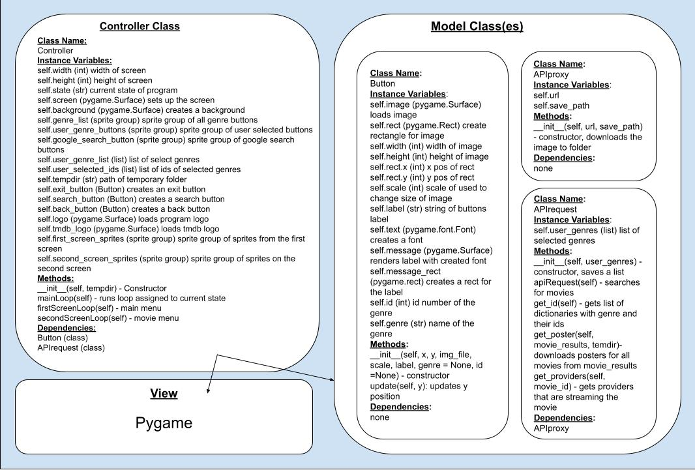
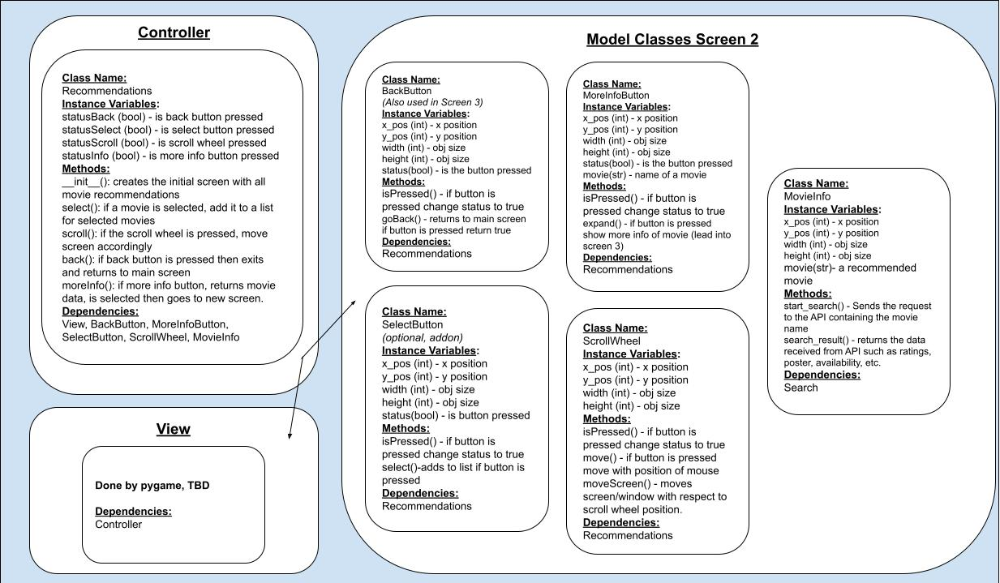

:warning: Everything between << >> needs to be replaced (remove << >> after replacing)
# CS110 Project Proposal
# Movie Recommender
## CS 110 Final Project
### Fall, 2021
### [Assignment Description](https://docs.google.com/document/d/1H4R6yLL7som1lglyXWZ04RvTp_RvRFCCBn6sqv-82ps/edit#)

[https://github.com/bucs110a0fall21/final-project-cinemadata](#)

<< [link to demo presentation slides](#) >>

### Team: CinemaData
#### Daniel Zheng, Wilson Huang, Kevin Wu

***

## Project Description *(Software Lead)*
This is a program that takes user input (genre(s), ratings, etc.) and using the inputted filters, sends a request to the an API for films that have the attributes given by the user. It displays the movies in a graphical interface and the user is able to click on the "More Info" button to get a detailed description of the movie as well as where to buy, stream, or display if the movie is currently in theaters.

***    

## User Interface Design *(Front End Specialist)*
* 
* Main Menu Screen
* Contains:
* Selection dropdown box
* Scrolling screen(scroll wheel is wish feature)
* Search button
* Remove button
* Selectable genres for the movie
* 
* Second Screen (Recommended movies)
* Contains:
* Poster for movies
* Back button
* Select button
* Scrolling screen
* More info button
* 
* Third Screen (Watchlist add-on)
* Contains:
* List of all the movies the user selected
* %20(1).png)
* Fourth Screen (More info screen)
* Contains:
* Information gathered from API about specific movie
* Also includes the previous back and scroll wheel

***        

## Program Design *(Backend Specialist)*
* Non-Standard libraries
    * (pygame)
    * Pygame
        * Documentation:  https://www.pygame.org/docs/
        * This module is used to create the "view" or visuals of the project.
* Class Interface Design
    * Main Menu (Screen 1)
    
    * Search Results (Screen 2)
    
    * Movie Details (Screen 3)
    
* Classes
    * Main Menu
        * Models 
            * GenreList - creates a list of movie genres and determines their selection status
            * GenreChosen - list of selected genres and option to remove genre from list
            * Select - confirms selection of genres and add them to the list of selected genres
            * SearchButton - searches for movies based on selected genres
        * Controller
            * Search - creates the screen and determines what if a search can be made based on user input
        * View
            * Managed by pygame, TBD
    * Search Results (Screen 2)
        * Models 
            * BackButton - goes back to main menu
            * MoreInfoButton - changes screen to show more information on a movie (goes to screen 3)
            * SelectButton - adds movie to movie list
            * ScrollWheel - changes position of screen based on user input
            * MovieInfo - gets movie information for all recommended movies
        * Controller
            * Recommendations - creates screen 2 and determines if buttons are pressed, calls certain class methods depending on the button pressed
        * View
            * Managed by pygame, TBD
    * More Info Screen (Screen 3)
        * Models 
            * MoviePage - detailed data of selected movie
            * ScrollWheel - (same as screen 2)
            * BackButton - goes back to screen 2
        * Controller
            * ExpandedMovieInfo - creates page with movie's rating, description, poster, availability, etc. and checks to see if back button or scroll wheel are pressed
        * View
            * Managed by pygame, TBD
    
    

## Project Structure *(Software Lead)*

The Project is broken down into the following file structure:
* main.py
* bin
    * <all of your python files should go here>
* assets
    * <all of your media, i.e. images, font files, etc, should go here)
* etc
    * <This is a catch all folder for things that are not part of your project, but you want to keep with your project. Your demo video should go here.>

***

## Tasks and Responsibilities *(Software Lead)*
* You must outline the team member roles and who was responsible for each class/method, both individual and collaborative.

### Software Lead - Kevin Wu

<< Worked as integration specialist by... >>

### Front End Specialist - Wilson Huang

<< Front-end lead conducted significant research on... >>

### Back End Specialist - Daniel Zheng

<< The back end specialist... >>

## Testing *(Software Lead)*
* << Describe your testing strategy for your project. >>
    * << Example >>

* Your ATP

| Step                  | Procedure     | Expected Results  | Actual Results |
| ----------------------|:-------------:| -----------------:| -------------- |
|  1  | Run Counter Program  | GUI window appears with count = 0  |          |
|  2  | click count button  | display changes to count = 1 |                 |
etc...